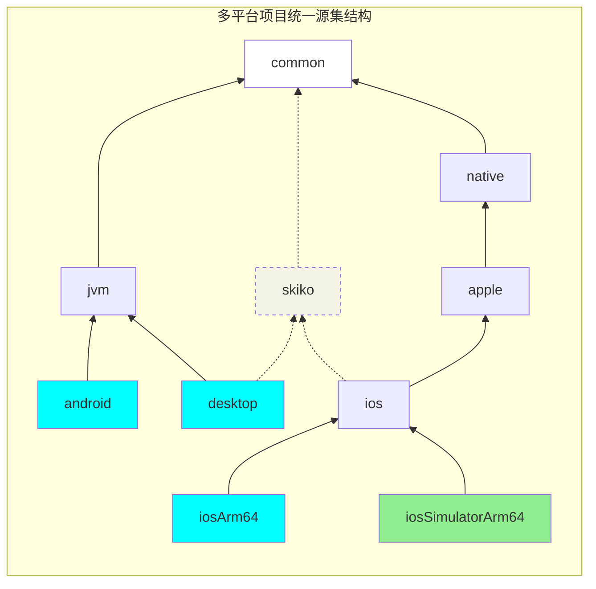
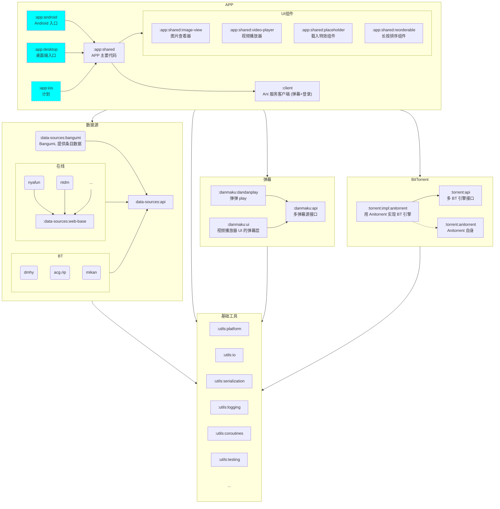
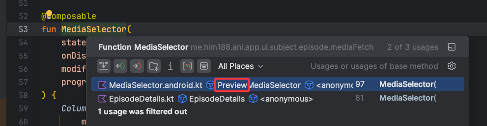
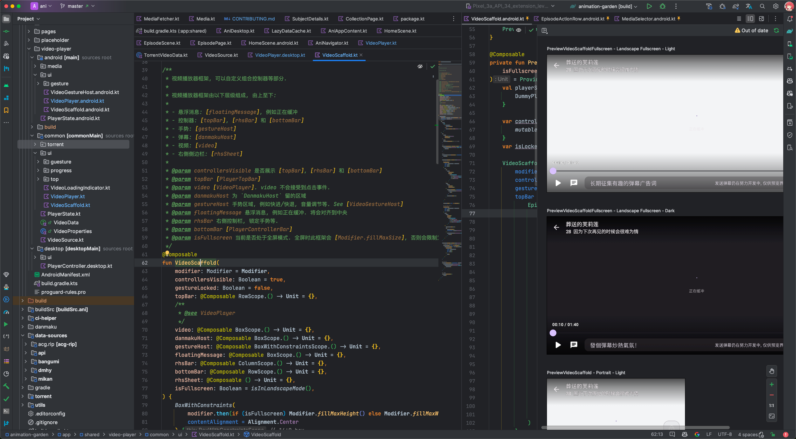

[Compose for Desktop]: https://www.jetbrains.com/lp/compose-desktop/

[动漫花园]: https://www.dmhy.org/

[KMP]: https://kotlinlang.org/docs/multiplatform.html

# 参与开发

欢迎你提交 PR 参与开发。本文将介绍项目结构等可能帮助你的内容。

## 获取帮助

如你对项目结构有任何疑问, 欢迎通过以下途径寻求帮助:
> 群里大部分是普通用户, 但也有一些开发者.
> 建议在群内问, 以便更多人看到你的问题.

- [](https://t.me/openani)
- [](http://qm.qq.com/cgi-bin/qm/qr?_wv=1027&k=2EbZ0Qxe-fI_AHJLCMnSIOnqw-nfrFH5&authKey=L31zTMwfbMG0FhIgt8xNHGOFPHc531mSw2YzUVupHLRJ4L2f8xerAd%2ByNl4OigRK&noverify=0&group_code=927170241)
  927170241
- [GitHub Discussions](https://github.com/him188/ani/discussions)

## 目录

1. 开发工具: IDE, JDK, 推荐插件
2. 代码风格: 格式化, 规范
3. 模块结构: 整个项目范围的模块划分, 模块间依赖
4. 依赖管理: 依赖版本管理
5. 构建打包: 如何编译, 如何打包 APK, 如何调试
6. App 架构: 最主要的客户端模块的层级划分, 以及各层的职责
7. 开发与调试: 源集结构, 预览 Compose UI, Navigation, 问答, 以及一些坑

## 1. 开发工具

请使用 Android Studio.

- 需要 JDK 版本至少为 17（如果系统没有, 会自动下载）
- 需要 Android SDK 版本至少为 API 34

安装如下 IDE 插件:

- Jetpack Compose
- Compose Multiplatform IDE Support
- Compose colors preview (可选安装, 用于预览颜色)
- ANTLR v4 (如果你要修改 BBCode 解析模块)

### 配置 Android NDK

Android 包含使用 Android NDK 的 C++ 代码. 你需要配置 NDK 才能开发:

1. 打开 SDK Manager (Android Studio 中 Tools -> SDK Manager)
2. 安装 NDK 和 Cmake

> [!WARNING]
> **Windows 特别提示**
>
> 建议设置 Git 使用 LF 并忽略文件权限.
>
>   ```shell
>   git config core.autocrlf false
>   git config core.eol lf
>   git config core.filemode false
>   git add --update --renormalize
>   ```

## 2. 代码风格

### 格式化

项目根目录有 `.editorconfig` 文件, IDE 会自动读取该文件以确保代码风格一致.
请使用 IDE 提供的自动代码格式化功能即可.

建议在 IDE 的 Commit 页面, 点击右下角设置, 勾选 "Reformat code" 和 "Optimize imports".
在提交时将会自动格式化代码.

### 代码规范

我们力求打造一个示范级质量的 Compose Multiplatform 项目.

为了达成这一点:

- 请遵循 [Kotlin 官方代码风格指南](https://kotlinlang.org/docs/coding-conventions.html)
- 请为新功能增加单元测试
- 请为新功能增加 UI 测试 (如何编写测试将在下面说明)
- PR 审核将会比较严格. 在保证项目代码质量的同时, 我们也希望尽可能地帮助你提高技术水平.
  审核者技术有限, 如有意见不统一的情况, 请务必提出, 相互学习 :)

## 3. 模块结构

Ani 现在已经是一个不小的项目, 本章节将给你一个全局的了解.

Ani 基于 Kotlin 多平台代码技术, 目前正式支持 Android, macOS, Windows 三个平台. 代码库中有正在开发中的
iOS 代码, 但还没有配置构建 iOS APP.

> [!TIP]
> [Kotlin 多平台][KMP] (Kotlin Multiplatform, 简称 KMP、MPP), 是 Kotlin 的多平台代码共享技术.
> 一个项目可以拥有多个编译目标平台, 例如桌面 JVM、 Android、iOS.
>
> 每个目标平台由多个源集组成. `common` 源集为全平台共享的通用代码, 多个目标之间能以任意程度共享代码.
> 例如, `android` 和 `desktop` 可以共同继承于一个 `jvm` 源集, 在 `jvm` 源集中的代码就可以共享给安卓和桌面平台;
> 同时 `ios` 和 `desktop` 还可以共同继承于一个 `skiko` 源集 (因为这两个平台上的 UI 都是用 Skiko
> 渲染的).
>
> 共享源集内, 可以使用各个平台的专有 API. 例如安卓和桌面都是 JVM, 也就都可以使用 JDK (Java) API.
> 在 iOS 源集内, 则可使用 native API, 例如 UIKit. 在 iOS 上, Kotlin 还支持 C/Objective-C 交互.

### 多平台源集结构

Ani 项目的几乎所有模块都使用 KMP. 源集结构如下:



> [!NOTE]
> 蓝色为最终目标. 它们将会构建成为 APP.
> 绿色的是 iOS 模拟器目标, 仅为运行测试.

> [!NOTE]
> Compose Multiplatform 在 `desktop` 和 `ios` 均使用 Skiko 渲染, 因此共享的 `skiko` 源集.
> 中间源集 `skiko` 为辅助作用. 主要的平台适配代码在 `jvm` 和 `apple` 中.

> [!TIP]
> 实际上有些模块的源集结构是不完整的 (更简单一些). 例如工具模块 `:utils:io` 不区分 `android`
> 和 `desktop`, 其 `jvm`
> 为最终目标. 因此它也没有中间源集 `skiko`.

### 模块结构

模块结构也对应源码目录结构.



> [!TIP]
> 蓝色的模块为 APP 的入口点. 它们里面只有微量的代码用来启动 `:app:shared` 中的 UI 等.
> 绝大部分客户端代码都在共享模块 `:app:shared` 中.
>
> > 这样做的一个原因是各个平台的构建限制:
> >
> > - Android 方面是因为 Android Library 无法在 manifest 定义 Activity.
> > - Compose for Desktop 在多平台项目里面构建很难配置, 因此用单独的模块只用于打包.

## 4. 依赖管理

Ani 使用 Gradle Version Catalogs.
依赖位于 [`gradle/libs.versions.toml`](/gradle/libs.versions.toml).

提示: 更新依赖后, 请先让 IDE sync 一下新的配置, 然后才能在 `build.gradle.kts` 中有 `libs.xxx` 的自动补全.

## 5. 构建打包

执行 `./gradlew build` 即可编译并运行测试 (前提是你已经配置了上面的几步)。需要正确的 Android SDK
配置才能完成编译。在没有配置时，编译将会出错并提示如何配置。

> [!NOTE]
> 如果提示找不到 `Res.*` , 请生成 Compose Multiplatform 资源:
> 执行 `./gradlew generateComposeResClass` 即可生成一个 `Res` 类, 用于在 `:app:shared` 访问资源文件.

要构建桌面应用，请参考 [Compose for Desktop]
官方文档，或简单执行 `./gradlew createReleaseDistributable`
，结果保存在 `app/desktop/build/compose/binaries` 中。

> [!NOTE]
> 一个操作系统只能构建对应的桌面应用，例如 Windows 只能构建 Windows 应用，而不能构建 macOS 应用。

要构建 Android 应用，请执行 `./gradlew assembleRelease` 或 `./gradlew assembleDebug`
，分别编译发布版或测试版。使用 `./gradlew installRelease` 或 `./gradlew installDebug` 还可以构建应用并安装到模拟器。

> [!WARNING]
> 默认情况下, 桌面端不会构建 Anitorrent (C++), 也就没有 BT 支持.
> 可阅读 [torrent/anitorrent/README.md](torrent/anitorrent/README.md) 了解如何配置 C++ 构建.

> [!TIP]
> **重复运行所有测试**
>
> 由于启用了 Gradle build cache, 如果代码没有修改, test 就不会执行.
>
> 可使用 `./gradlew clean generateComposeResClass check` 清空测试的缓存并重新运行所有测试.

## 6. App 项目架构

本节将介绍客户端共享模块 (`:app:shared`) 的架构设计.

> 也就是对应目录 `app/shared` 里的内容.

在 `:app:shared` 中,
参照 [Android 应用程序模块化指南](https://developer.android.com/topic/modularization),
Ani 按照功能进行了一定程度的模块化.

`app/shared` 下有许多目录, 每个目录存放一个功能的所有相关代码:

建议你打开 IDE 对照看.

### `data`: 数据层

包含所有外部数据和本地持久化存储的高级封装. 后面介绍的 UI 层不会进行 HTTP 请求或是文件访问,
而是调用这里的接口.

数据层包含许多模块：

* `models`: App UI 或其他组件使用的数据结构，外部数据源的数据结构将会转换到此包中数据结构.
* `persistent`: 数据持久化包，例如轻量数据 preference 和大量数据 database.
* `repository`: 数据仓库，通常是外部数据源与 App 交互的中间仓库.
* `source`: 数据源.

App 主要通过 `repository` 和 `source` 与外部数据交互.

data
还提供了一个 [
`MediaFetcher`](https://github.com/open-ani/ani/tree/master/app/shared/src/commonMain/kotlin/data/source/media/fetch/MediaFetcher.kt#L59),
封装了对番剧的下载链接获取逻辑.

### `foundation`: 基础组件

提供 i18n 支持, 通用的 UI 组件, 对平台交互的封装等.

### `placeholder`

来自 Google Accompanist 的 `Placeholders` 基础库. 由于 Google 已经停止维护, 这里就复制了一份.

它提供 `Modifier.placeholder`, 可在数据还在加载中时, 在 Composable 之上覆盖一个特效表示正在加载.

### `video-player`

提供一个视频播放器 Composable: `VideoPlayer`, 对应地它的逻辑封装在 `PlayerState`.
由于它依赖了一些 `foundation` 的组件, 所以没有放在项目顶层.

### `pages`: 按 UI 页面分类的功能模块

UI 设计采用 MVVM 模式.

`ui/pages` 目录中, 按照在 APP 实际运行时会展示的页面区分子目录. 相关联的 View (`@Composable`) 和
ViewModel 放置在同一目录下.

- `main`: 整个 APP UI 的入口点, 实现各个页面之间的跳转等
- `home`: 首页
- `subject-collection`: "我的收藏"页面
- `subject-details`: 番剧详情页面 (可看声优列表等)
- `episode-play`: 剧集详情以及播放页面
- ...

每个页面目录, 有 `common`, `android`, `desktop` 三个子目录.
它们分别存放共享代码, Android 端代码, 桌面端代码. (Kotlin MPP 特性)

若你不了解 Kotlin MPP, 简单来说:

- `common` 内放置可同时在两个平台跑的代码, `android` 内放置只能在 Android 平台跑的代码, `desktop`
  内放置只能在桌面 JVM 平台跑的代码.
- 编译 `android` 时, Kotlin 会合并 `common` 与 `android` 的代码一起编译.
- `android` 内, 可以访问 `common` 内的代码, 还可以访问 Android SDK 例如 `Activity`.
- 在 `common` 内, 不能访问 Android SDK, 也不能使用 Java Swing 等 Android 上不支持的功能.
- 在 `common` 内可以使用 `expect fun` 定义一个没有函数体的函数, 然后在 `android` 或 `desktop` 内使用
  `actual fun` 实现它, 这样就可以在 common 内间接访问到平台相关的功能.
- 详细参考 [Kotlin 官方文档](https://kotlinlang.org/docs/multiplatform-discover-project.html)

#### UI 层组织方式

Ani 目前只有一个 `MainActivity`. `MainActivity` 使用 `AniAppContent`.

`AniAppContent` 位于 `pages/main` 目录中, 它是 UI 的入口点.
它引用了所有的页面并实现了页面之间的跳转.

每一个页面通常分别有一个 `Screen` 和 `Page`.
`XXXScreen` 用于实现页面之间的跳转, `XXXPage` 用于实现页面的具体内容.
`Screen` 会访问当前 navigation BackStackEntry, 获取该页面的参数并根据参数决定该如何展示 Page.

有的页面可以拥有多个 Page, 例如 `HomeScreen` 也就是进入 APP 后看到的页面, 它可以通过底部导航栏切换不同的
Page (首页/我的收藏/个人中心).

> 这样的设计让 Page 不依赖 navigation, 就可以在开发时实时预览.

### Ani 的数据层

数据层主要包含两个部分: 单独的数据源 (`:data-sources`) 与放在 `app/shared/data`
目录的数据仓库 (`Repository`).

各数据源位于 app 模块之外的项目根目录的 `data-sources` 目录下. 数据源列表:

- `data-sources/bangumi`: Bangumi 索引数据源, 提供番剧索引, 观看记录等.
    - API 客户端使用其官方 OpenAPI 文档自动生成
- `data-sources/api`: 下载数据源的抽象, 定义了数据源的接口以供接入多个下载数据源.
- `data-sources/dmhy`: 动漫花园下载数据源, 只提供番剧下载链接.
- `data-sources/acg.rip`: acg.rip 下载数据源, 只提供番剧下载链接.
- `data-sources/mikan`: mikanani.me 下载数据源, 只提供番剧下载链接.
- ... 欢迎 PR 更多支持例如 SMB

## 7. 开发与调试

### 源集 (source set) 结构

为了减少文件树层级, 项目使用了一些特殊的源集结构.

在 `commonMain` 或 `common`, `androidMain` 或 `android` 目录直接存放 `.kt` 源码,
而不需要 `src/kotlin` 目录.
资源放置于 `commonResources`, `androidResources` 等目录下.

若你不是很清楚 Gradle 这方面的功能, 只需模仿已有的源代码存放新文件就行.

### 预览 Compose UI

因为项目支持 Android 和桌面两个平台, 预览也就分两个平台. 绝大部分 UI 代码在 Android 的桌面的效果是一模一样的,
因此使用一个平台的预览即可.

在 common 中使用 `@Preview` 将进行桌面平台的预览, 但桌面预览不支持可交互式预览 (Interactive Mode),
也不支持即时刷新, 不推荐.

在开发时, 通常建议在 android 中编写预览代码. 你可以通过 IDE 分屏功能将 android 预览放到一边.

#### 查找已有页面的预览

用 IDE 查找想要预览的 Composable 的实现就能找到 (按住 Ctrl 点击函数名). 几乎所有的页面都有 Android
的预览.



#### 示例: 视频播放器的 Android 预览

使用视频播放器作为示例, 视频播放器的入口点是 `VideoScaffold`, 它提供播放器的框架.
调用方在该框架上通过参数传递 `topBar`, `video`, `danmakuHost` 等组件来组装一个视频播放器 UI.

[`VideoScaffold`](https://github.com/Him188/ani/tree/master/app/shared/video-player/common/ui/VideoScaffold.kt#39)
是通用的, 全部代码都位于 common 中:

`app/shared/video-player/common/ui/VideoScaffold.kt`

```kotlin
@Composable
fun VideoScaffold() {
}
```

[
`PreviewVideoScaffold`](https://github.com/Him188/ani/tree/master/app/shared/video-player/android/ui/VideoScaffold.android.kt#L47)
位于 `app/shared/video-player/android/ui/VideoScaffold.android.kt`:

```kotlin
@Preview
@Composable
private fun PreviewVideoScaffold() {
    VideoScaffold()
}
```



### Navigation

Navigation 使用了 [PreCompose](https://github.com/Tlaster/PreCompose). 它与 Jetpack NavHost 用法类似.
*也有很多坑, 但我已经踩完了.*

跳转功能已经封装为了 `AniNavigator`, 在任意 Composable 中可以使用 `LocalAniNavigator.current` 获取当前
navigator,
然后使用
`navigateXxx` 进行跳转.

### 如何找到我想修改的页面/功能?

从 UI 入手, 全局搜索页面上会显示的文字的字符串最简单.

你也可以用遍历的方式:

1. 所有 UI 页面都在 `app/shared/pages` 目录下.
2. 进入每个目录看它们的 `XXXPage` 或 `XXXScreen` 文件.

### 如何增加一个新页面

1. 在 `app/shared/pages` 目录下创建一个新目录, 例如 `pages/person-details`
2. 在 `app/shread/build.gradle.kts` 中仿照现有代码,
   添加一行 `submodule("app/shared/pages/person-details")`
3. 创建 `app/shared/pages/person-details/common`, `.../android`, `.../desktop`
4. 在三个目录中分别创建 `package.kt`, 内容为 `package me.him188.ani.app.ui.person.details` (
   根据你的页面名称修改)
   > 这是为了设置改目录下的默认包名.
5. 然后就可以在 `common` 里添加 `PersonDetailsPage`, `PersonDetailsViewModel` 等了. 可以参考
   已有的类似的页面的实现. 例如对于实现人员详情页面, 可以参考 `SubjectDetailsPage`.
