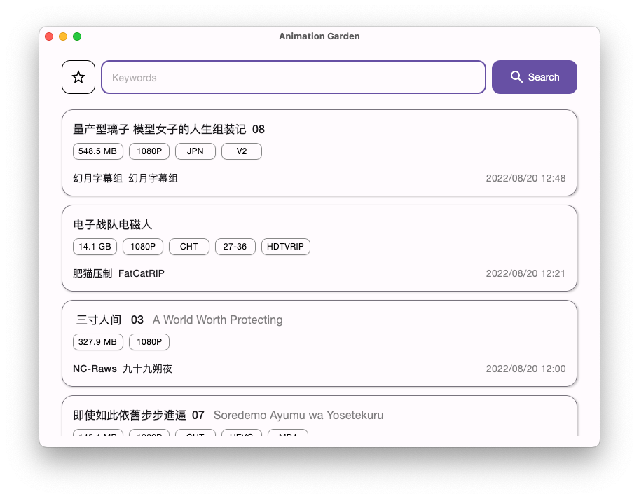
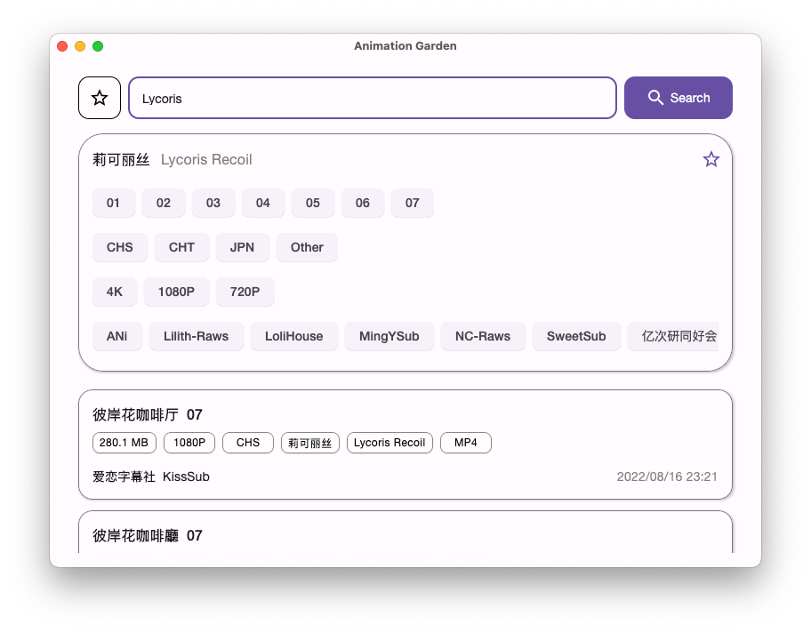
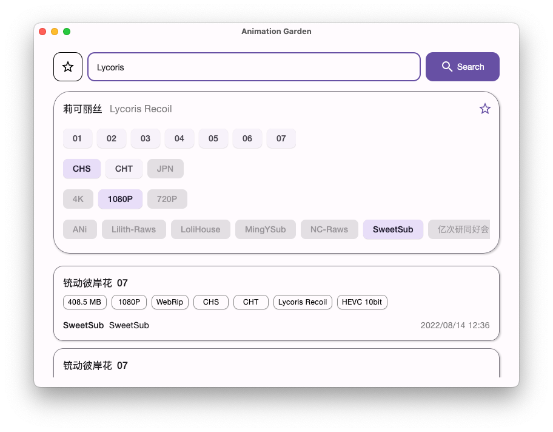
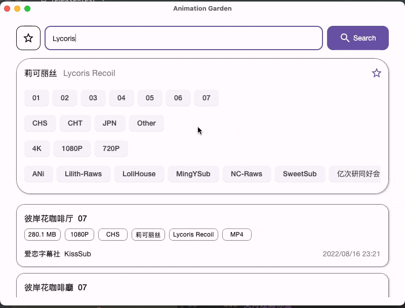

# 动漫花园

[动漫花园]: http://www.dmhy.org/

[Compose Multiplatform]: https://www.jetbrains.com/lp/compose-mpp/

美观且实用的[动漫花园]的多平台应用程序，使用 [Compose Multiplatform] 构建。

## 下载

此应用支持 macOS、Ubuntu、Windows 与 Android。
可在 [releases](https://github.com/Him188/animation-garden-desktop/releases/latest) 中的 "Assets" 下载最新正式版本。

测试版本可以在 [releases](https://github.com/Him188/animation-garden-desktop/releases/) 找到。使用测试版本可以体验最新特性，但可能会遇到一些问题。

对于所有桌面平台：

- `.zip` 是包含 JRE 的解压即用的绿色版本；
- `.dmg`、`.deb` 和 `.msi` 分别对应 macOS、Ubuntu 和 Windows 的安装程序；
- `.jar` 是不包含 JRE 的最小程序，需要配合 JRE 11 及以上使用。

对于 Android，请下载 `.apk` 安装包使用。

Android 版与桌面版的功能是一样的。

## 参与

欢迎你提交 [PR](https://github.com/Him188/animation-garden-desktop/pulls) 参与开发。

由于我家有咖啡机，就不需要你捐助咖啡了，谢谢你。

## 提示

#### 访问动漫花园

动漫花园在中国大陆无法通过 IPv4 访问。你可能需要一些技术手段，或者使用 IPv6，才能正常使用。

在桌面端，可以在设置（Windows 在标题栏，macOS 在屏幕左上角点击"动漫花园"）中设置使用代理。代理是默认禁用的。初始的 HTTP 代理设置为连接本地 Clash 并使用 Clash 的默认端口。

#### 额外设置

部分桌面端会支持额外设置，这些设置都可以由上述方法看到，如果看不到就是没有。例如 macOS 端支持窗口沉浸（将背景颜色绘制到标题栏内，默认启用）。

## 功能

### 查看最新话题

打开应用即可看到最新话题列表。话题列表是一个无限流，当滑动到最低端时，它将加载更多内容。

### 以作品为中心搜索

可根据关键词搜索话题。应用将自动识别该关键词对应的作品信息，并统合搜索结果，以作品为中心查看结果。

### 过滤标签

在统合搜索结果中点击标签可以执行过滤，快速查找想要的内容。

### 收藏作品并记忆搜索偏好和观看记录

点击卡片右上角的五角星即可添加或取消收藏。收藏的作品会记忆搜索偏好以及剧集观看记录。在查看收藏列表时会自动更新剧集列表，点击剧集可跳转搜索。

### 多端即时同步

使用同一个同步 token 时，在一个客户端进行修改可以即时同步到其他在线客户端，确保流畅体验。

要启用同步，请在设置中勾选 "与服务器同步"。所有客户端都支持多端即时同步。

### 界面简洁流畅

[MD3]: https://m3.material.io/

应用采用 [质感设计 3][MD3]，界面简洁而功能齐全。所有动作都配有流畅的动画。针对多平台设计，应用支持无极可调窗口大小。

