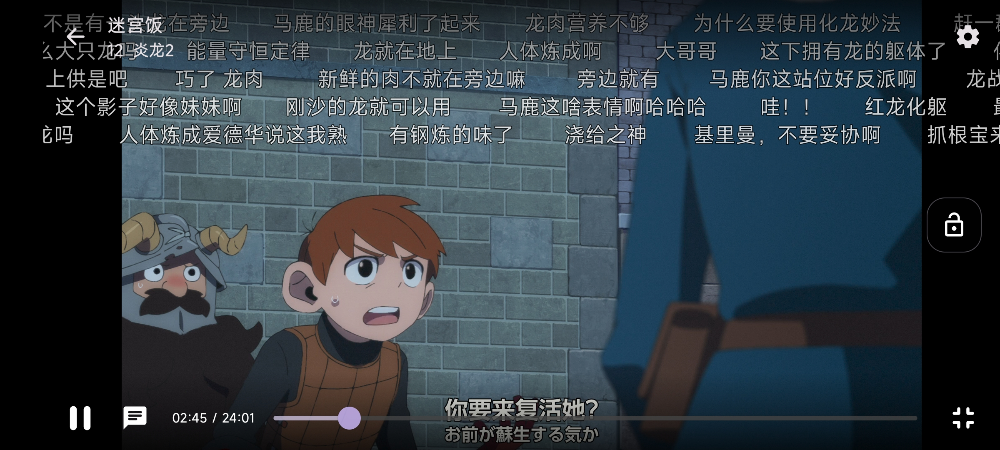
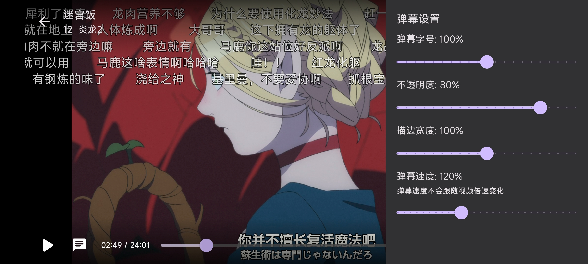

# Ani

[dmhy]: http://www.dmhy.org/

[Bangumi]: http://bangumi.tv

[ddplay]: https://www.dandanplay.com/

[Compose Multiplatform]: https://www.jetbrains.com/lp/compose-mpp/

[acg.rip]: https://acg.rip

集找番、追番、弹幕看番的一站式追番平台。

使用 [Bangumi][Bangumi] 的番剧索引以及观看记录功能，支持 [动漫花园][dmhy] 和 [acg.rip][acg.rip]
数据源，接入[弹弹play][ddplay]平台实现在线弹幕播放.

开发重点在于找番和追番的实际体验, 可能不会追求对 Bangumi 功能接入的完整性.
项目来源于我和朋友的真实追番需求: 记录追番进度, 下载字幕组资源等.

> 我不是专业客户端开发人员, 开发纯属兴趣, 不过有点讲究代码质量, 欢迎各位指点.

## 3.0 开发进程

Ani 3.0 **正在**开发中. 跨平台架构. UI 框架使用 [Compose Multiplatform].

### 参与开发

欢迎你提交 PR 参与开发, 如果很大兴趣我也很乐意为这个项目创建一个组织以共同维护.
有关项目技术细节请参考 [CONTRIBUTING](CONTRIBUTING.md)。

## 下载

Ani 支持 Android 和桌面端 (macOS、Linux、Windows)。

3.0 开发还在进行中, 我会每隔几个修改发布一个 beta 测试版本,
请关注 [releases](https://github.com/Him188/ani/releases/latest)
以下载最新正式版本。(注意: 2.0 与 3.0 完全不同, 不建议使用 2.0 (*它大概率已经不能用了*))

测试版本有*很多*问题, ~*目前请不要抱有太大期望, 但我是每天都用的*~. 欢迎测试并在 issue 反馈问题.

## 功能截图

快速开发中, 我每隔几天会更一下截图. 实际样式请以最新版本为准.

采用 Material 3 风格, 支持同步系统的浅色和深色主题.

因为使用的是安卓原生 Compose, 应用可全程保持屏幕刷新率运行.

### 登录

使用 Bangumi OAuth (浏览器) 登录, 即软件会跳转到 Bangumi 官网授权, 不要求在客户端内输入账号密码.

### 管理追番

- 同步 Bangumi 收藏
- 快捷修改收藏状态
- 按"在看/想看/看过"分类
- 快速跳转到下一集

 

### 条目详情

根据一般人找番时会关注的如下几点设计:

- 开播时间
- 声优
- 制作公司, 监督
- 海报第一印象
- 角色第一印象
- 追番人数
- 评分 *(计划实现)*

 

### 在线视频播放

- 从[动漫花园][dmhy]与[acg.rip](https://acg.rip)拉取字幕组资源
- 支持按清晰度, 字幕语言与字幕组选择视频源
- 手动修改字幕组后下次播放会自动选择

 

- 从 [弹弹play][ddplay] 获取弹幕
- 支持自定义弹幕样式与速度

视频手势:

- 双击屏幕切换播放/暂停
- 左右滑动屏幕快进/快退
- 在屏幕右边上下滑动调整音量
- *倍速播放等其他辅助功能将在之后的里程碑实现*

 

### 评论

UI 写好了, 但是 Bangumi 目前没提供评论的 API, 在考虑怎么解决.

### 以标题搜索

在首页, 目前支持使用标题关键词搜索. 其他搜索方式计划实现中.

### 桌面端

除了 (目前) 不支持视频播放以外, 与 Android 端功能一致. 可使用 "下载" 功能跳转到外部下载器下载视频.

桌面端视频播放功能计划使用内嵌 Web 播放器实现, 如有更好方案欢迎指点.

## 提示

#### 访问动漫花园

动漫花园在中国大陆无法通过 IPv4 访问。你可能需要一些技术手段，或者在一个有 IPv6 的环境 (例如数据网络)
，才能正常使用。

在桌面端，可以在设置（Windows 在标题栏，macOS 在屏幕左上角点击"动漫花园"）中设置使用代理。代理是默认禁用的。初始的
HTTP
代理设置为连接本地 Clash 并使用 Clash 的默认端口。
