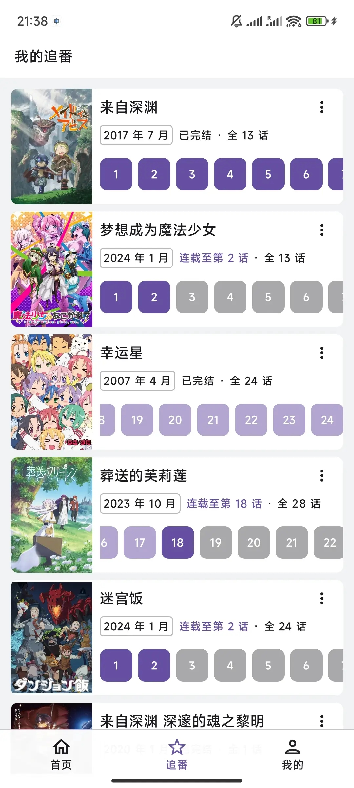
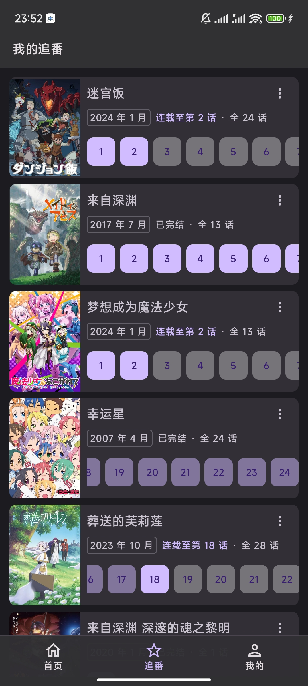
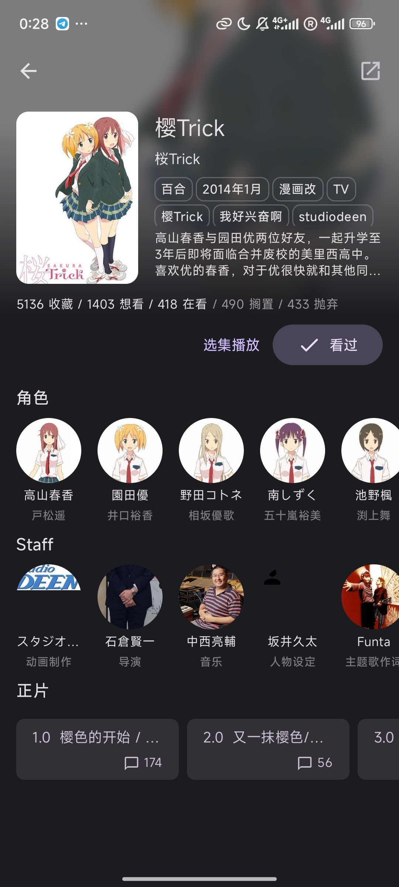
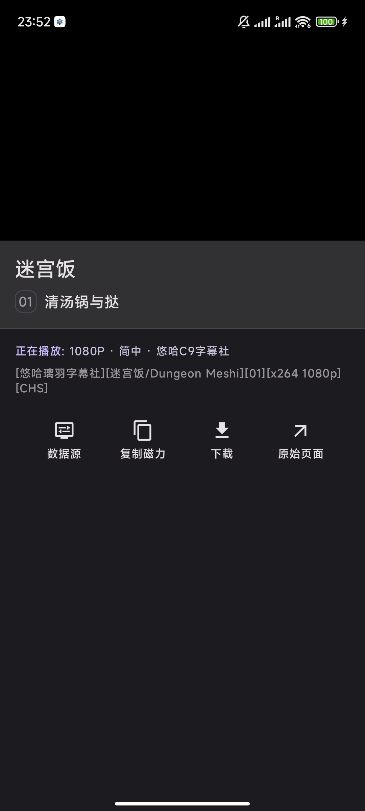
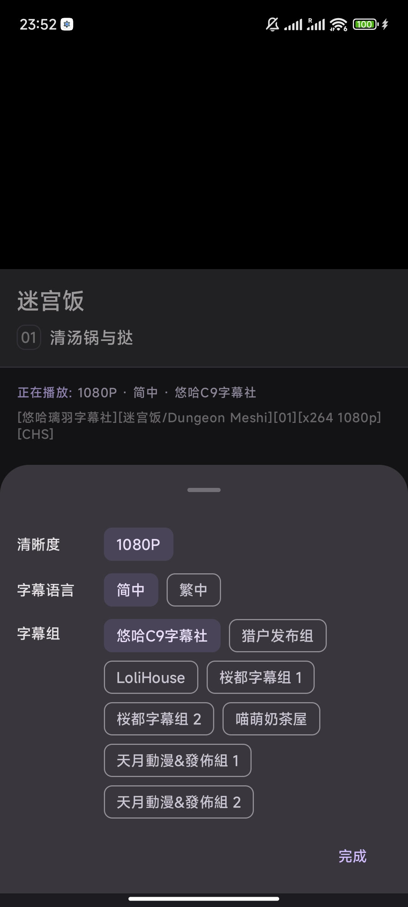
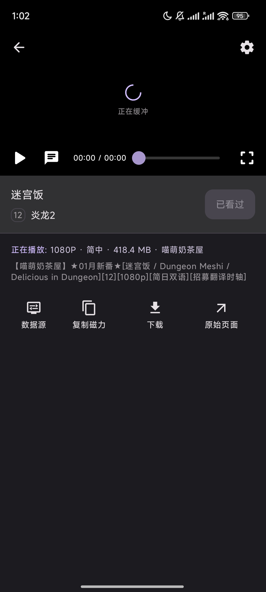
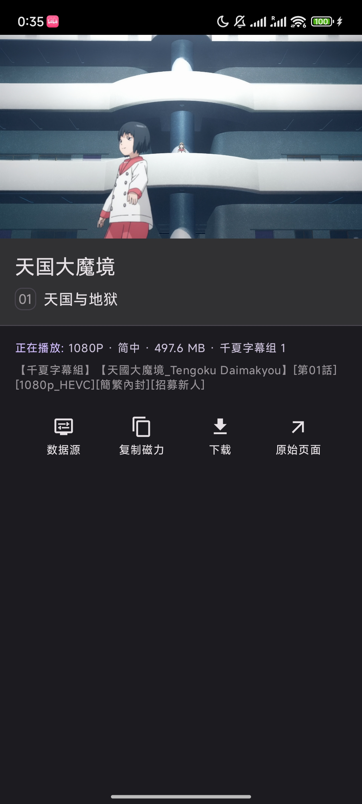

# Ani

[dmhy]: http://www.dmhy.org/

[Bangumi]: http://bangumi.tv

[ddplay]: https://www.dandanplay.com/

[Compose Multiplatform]: https://www.jetbrains.com/lp/compose-mpp/

集找番、追番、弹幕看番的一站式追番平台。

使用 [Bangumi][Bangumi] 的番剧索引以及观看记录功能，支持 [动漫花园][dmhy]
等下载源，未来接入[弹弹play][ddplay]等平台实现在线弹幕播放。

开发重点在于找番和追番的实际体验, 可能不会追求对 Bangumi 功能接入的完整性.
项目来源于我和朋友的真实追番需求: 记录追番进度, 下载字幕组资源等.

> 我不是专业客户端开发人员, 开发纯属兴趣, 不过比较讲究代码质量, 欢迎各位指点.

## 3.0 开发进程

Ani 3.0 **正在**开发中. 继续使用 [Compose Multiplatform] 实现多平台, 将私有追番进度服务器改为使用
Bangumi,
并从 Bangumi 获取番剧信息以及相关评论等.

## 下载

Ani 支持 Android 和桌面端 (macOS、Linux、Windows)。

3.0 重构还在进行中, 2.0 正式版本可在 [releases](https://github.com/Him188/ani/releases/latest)
中的 "Assets" 下载最新正式版本。(注意: 2.0 与 3.0 完全不同)

2.x 测试版本可以在 [releases](https://github.com/Him188/ani/releases/) 找到。
使用测试版本可以体验最新特性，但可能不稳定。

~3.0 开发测试版本可以在每个 commit 的自动构建中找到。~ CD 发生了点意外, 3.0 构建没在运行,
等第一个里程碑发布后会修复.

## 未来 3.0 功能截图

快速开发中, 我每隔几天会更一下截图. 实际样式请以最新版本为准.

采用 Material 3 风格 (略有根据个人审美调整), 支持同步系统的浅色和深色主题。

### 登录

使用 Bangumi OAuth (浏览器) 登录, 即软件会跳转到 Bangumi 官网授权, 不要求在客户端内输入账号密码.

### 个人收藏页面

- 同步 Bangumi 收藏
- 支持修改收藏状态
- "已完结" / "连载至" 标签展示连载情况
- 自动滚动到上次观看的剧集, 已观看过的剧集展示颜色更浅

 

### 番剧详情页面

根据一般人找番时会关注的如下几点设计:

- 开播时间
- 声优
- 制作公司, 监督
- 海报第一印象
- 角色第一印象
- 追番人数
- 评分 *(计划实现)*

待 3.0 正式版发布后的未来会增加其他更多补充信息.

 

### 剧集详情

- 后台自动从[动漫花园][dmhy]拉取字幕组资源并解析标题
- 支持选择一般人最关心的参数: 清晰度, 字幕语言, 字幕组
- 默认选择第一个字幕组, 无需配置即可自动播放
- 手动修改字幕组后会为此番剧记住字幕组选择, 下次自动选择

 

### 在线视频播放

- 选择字幕组后自动开始播放.
- 第一个里程碑会支持播放/暂停, 显示播放进度, 拖动进度条, 切换全屏/小窗.
- 播放完成后自动标记为已观看, 并跳转到下一集.
- 倍速播放, 手势调音量等辅助功能将在之后的里程碑实现.

 

### 弹幕与评论

计划中, 将在第二个里程碑支持.

### 标题 / 标签搜索页面

~重构掉了, 下次补上~

### 桌面端

Compose 在安卓上的预览和生态比较好, 因此先做了安卓. 桌面端一定会开发, 因为我个人平常看番主要使用桌面端.

桌面端计划初版不会做视频播放, 只做跳转下载. 桌面端做好后移动端也将会支持平板模式 (复用).

桌面端视频播放功能可能会用外置播放器, 配合悬浮窗弹幕引擎? 如有更好方案欢迎指点.

## 参与开发

欢迎你提交 [PR](https://github.com/Him188/ani/pulls) [参与开发](CONTRIBUTING.md)。

## 提示

#### 访问动漫花园

动漫花园在中国大陆无法通过 IPv4 访问。你可能需要一些技术手段，或者在一个有 IPv6 的环境 (例如数据网络)
，才能正常使用。

在桌面端，可以在设置（Windows 在标题栏，macOS 在屏幕左上角点击"动漫花园"）中设置使用代理。代理是默认禁用的。初始的
HTTP
代理设置为连接本地 Clash 并使用 Clash 的默认端口。
