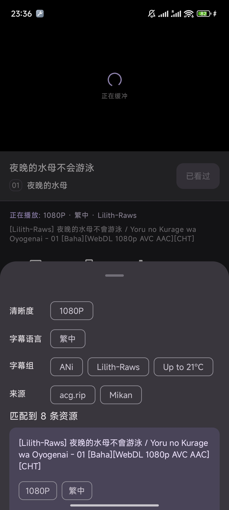
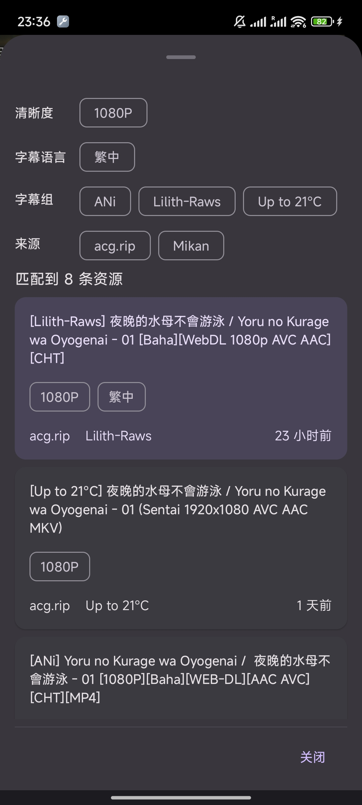
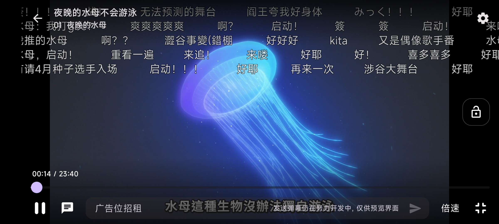
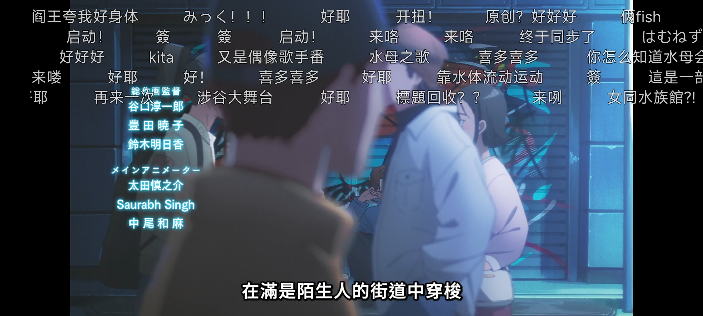
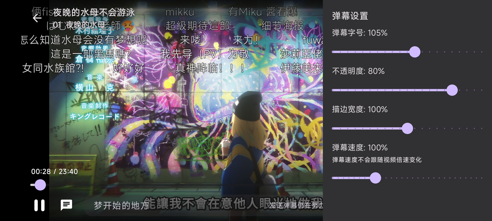
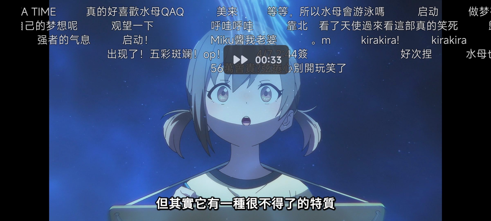
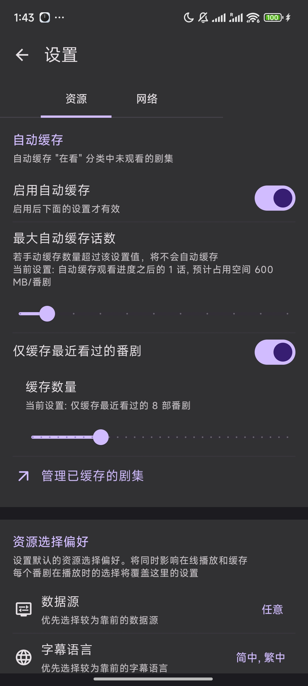
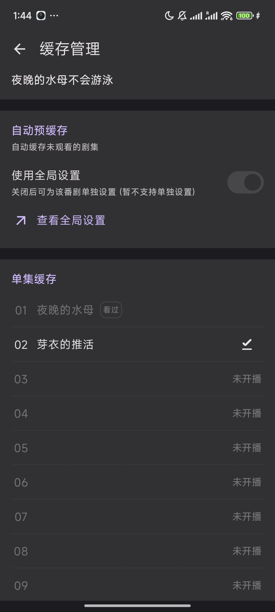
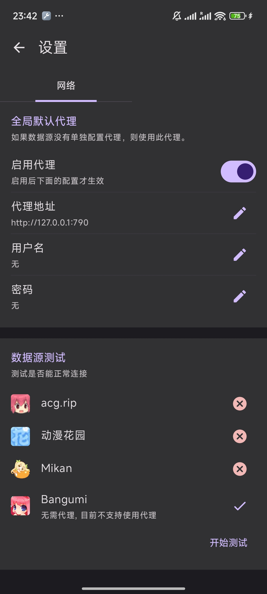

# Ani

[dmhy]: http://www.dmhy.org/

[Bangumi]: http://bangumi.tv

[ddplay]: https://www.dandanplay.com/

[Compose Multiplatform]: https://www.jetbrains.com/lp/compose-mpp/

[acg.rip]: https://acg.rip

[Mikan]: https://mikanani.me/

集找番、追番、看番的一站式弹幕追番平台。

Ani 的目标是提供舒适的弹幕追番体验。

支持云同步观看记录 ([Bangumi][Bangumi]), 多视频数据源, 弹幕播放, 以及更多功能。

> 我不是专业客户端开发人员, 开发纯属兴趣, 不过有点讲究代码质量, 欢迎各位指点.

## 3.0 新版开发中

Ani 3.0 **正在**开发中. 以下几点可以给你一个技术上的大概了解, 不感兴趣的可以直接看[截图](#功能截图).

- Kotlin 跨平台架构: Android + 桌面 JVM
- UI 100% [Compose][Compose Multiplatform]
- 独立 Compose 弹幕引擎, 预留接入其他弹幕数据源的接口
- 独立 Compose 视频播放器, Android 底层为 ExoPlayer
- 独立的抽象数据源对接模块: SPI 方式加载 [动漫花园][dmhy], [acg.rip][acg.rip], [Mikan][Mikan],
  支持扩展私有数据源, 局域网缓存服务器等

### 参与开发

欢迎你提交 PR 参与开发, 如果很大兴趣我也很乐意为这个项目创建一个组织以共同维护.
有关项目技术细节请参考 [CONTRIBUTING](CONTRIBUTING.md)。

## 下载

Ani 支持 Android 和桌面端 (macOS、Linux、Windows)。

3.0 功能正逐渐完善, 每隔几天会发布一个 beta 测试版本。

欢迎加入 QQ 群 927170241（[PC 一键加入](http://qm.qq.com/cgi-bin/qm/qr?_wv=1027&k=2EbZ0Qxe-fI_AHJLCMnSIOnqw-nfrFH5&authKey=L31zTMwfbMG0FhIgt8xNHGOFPHc531mSw2YzUVupHLRJ4L2f8xerAd%2ByNl4OigRK&noverify=0&group_code=927170241)）或 Telegram 群 [点击加入](https://t.me/+afDaMsCSIcsyNDVk)

请关注 [releases](https://github.com/Him188/ani/releases/latest)
以下载最新版本

## 功能截图

快速开发中, 我每隔几天会更一下截图. 实际样式请以最新版本为准.

### 登录

使用 [Bangumi][Bangumi] OAuth (浏览器) 登录, 不要求在客户端内输入账号密码.

### 管理追番

- 同步 [Bangumi][Bangumi] 收藏
- 快捷修改收藏状态
- 按"在看/想看/看过"分类
- 快速跳转到下一集

 

- 根据找番时会关注的声优, 制作公司, 监督等几点设计

 

### 多数据源在线视频播放

多数据源适配, 总有一个源有你想看的番和喜欢的字幕组

- 自动解析资源, 可按分辨率, 字幕语言与字幕组选择视频源
- 记忆上次选择, 下次直接播放

    

### 视频弹幕

- 从[弹弹play][ddplay]以及*其他弹幕网站*获取弹幕
- 支持自定义弹幕样式与速度
- 发送弹幕到 Ani 服务器

> 你可能注意到了, 图里的 "广告位招租" 其实是开玩笑,
> 有其他有意思的弹幕广告词创意欢迎[提交](https://github.com/Him188/ani/discussions/120)

### 视频手势

你习惯的视频手势

- 双击切换播放/暂停
- 左右滑动快进/快退
- 左侧上下滑动调整亮度
- 右侧上下滑动调整音量
- 倍速播放
- 锁定手势

### 资源偏好设置

- 设置全局优先选择的字幕组, 字幕语言等设置
- 在观看时修改过滤可自动记忆并应用到下次播放和自动缓存

  

### 视频缓存

- 自动根据资源偏好设置缓存观看进度的下一集
- 管理缓存的所有视频
- 按番剧分类管理

   

### 完全免费无广告且开放源代码

- 使用靠谱的 [Bangumi][Bangumi] 记录追番数据, 不怕网站跑路丢失数据
- 视频播放使用 P2P 资源, 无服务器维护成本, ~即使我跑路了 Ani 也能用~
- 开放源代码, 公开自动构建, 无资料泄露风险
- 可 PR 添加自己喜欢的功能 (只要不用于商用)

### 代理设置

自 3.0.0-beta15 起，Ani 增加了一个全球均可访问的数据源，无需设置代理。若你想要，也可以设置代理后使用所有数据源。代理设置入口为"我的"的右上角。

### 桌面端

除了目前不支持视频播放以外, 桌面端其他功能与 Android 端功能一致. 桌面端可使用 "下载" 功能跳转到外部下载器下载视频.

桌面端视频播放功能正在开发中 [#115](https://github.com/Him188/ani/issues/115)
