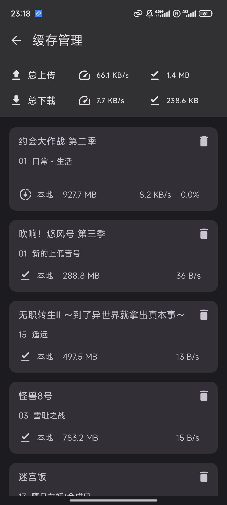
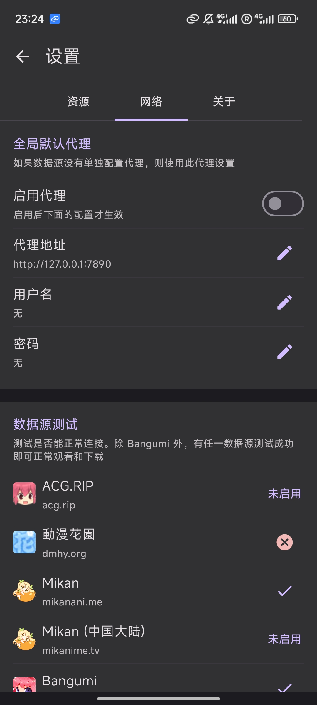

# Ani

[dmhy]: http://www.dmhy.org/

[Bangumi]: http://bangumi.tv

[ddplay]: https://www.dandanplay.com/

[Compose Multiplatform]: https://www.jetbrains.com/lp/compose-mpp/

[acg.rip]: https://acg.rip

[Mikan]: https://mikanani.me/

集找番、追番、看番的一站式弹幕追番平台。

Ani 的目标是提供尽可能简单且舒适的追番体验。

支持云同步观看记录 ([Bangumi][Bangumi]), 多视频数据源, 缓存, 弹幕, 以及更多功能。

> 我不是专业客户端开发人员, 开发纯属兴趣, 不过有点讲究代码质量, 欢迎各位指点.

## 3.0 新版开发中

Ani 3.0 **正在**开发中. 以下几点可以给你一个技术上的大概了解, 不感兴趣的可以直接看[截图](#功能截图).

- Kotlin 多平台架构: Android + 桌面 JVM，绝大部分代码共享在 app/shared
- UI 100% [Compose][Compose Multiplatform]
- Compose 弹幕引擎，自建弹幕服务器+网络弹幕源，预留接入其他弹幕数据源的接口
- Compose 视频播放器，Android 底层为 ExoPlayer，PC 底层为 VLC
- 独立的抽象数据源对接模块：SPI 方式加载 [动漫花园][dmhy]、[acg.rip][acg.rip]、[Mikan][Mikan] 等。现阶段支持代码里扩展私有数据源，局域网缓存服务器等。未来计划开放 API

### 参与开发

欢迎你提交 PR 参与开发, 如果很大兴趣我也很乐意为这个项目创建一个组织以共同维护.
有关项目技术细节请参考 [CONTRIBUTING](CONTRIBUTING.md)。

## 下载

Ani 支持 Android 和桌面端 (macOS、Windows)。现阶段对 Android 支持最佳, PC 需要依赖 qBittorrent 才能下载 BT 视频，但不安装 qBit 也可以使用在线数据源。

3.0 功能正逐渐完善, 每隔几天会发布一个 beta 测试版本。

欢迎加入 QQ 群
927170241（[PC 一键加入](http://qm.qq.com/cgi-bin/qm/qr?_wv=1027&k=2EbZ0Qxe-fI_AHJLCMnSIOnqw-nfrFH5&authKey=L31zTMwfbMG0FhIgt8xNHGOFPHc531mSw2YzUVupHLRJ4L2f8xerAd%2ByNl4OigRK&noverify=0&group_code=927170241)
）或 Telegram 群 [点击加入](https://t.me/+afDaMsCSIcsyNDVk)

请关注 [releases](https://github.com/Him188/ani/releases/latest)
以下载最新版本

## 功能截图

快速开发中, 我每隔几天会更一下截图. 实际样式请以最新版本为准.

### 登录

使用 [Bangumi][Bangumi] OAuth (浏览器) 登录, 不要求在客户端内输入账号密码.

### 管理追番

- 同步 [Bangumi][Bangumi] 收藏
- 快捷修改收藏状态
- 按"在看/想看/看过"分类
- 快速跳转到下一集

 

- 根据找番时会关注的声优, 制作公司, 监督等几点设计
  > 其实这个页面并未实现很多功能, 在计划中

 

### 多数据源在线视频播放

多数据源适配, 总有一个源有你想看的番和喜欢的字幕组

- 自动解析资源, 可按分辨率, 字幕语言与字幕组选择视频源
- 记忆上次选择, 下次直接播放
- 支持季度全集资源

    

### 视频弹幕

- 从[弹弹play][ddplay]以及*其他弹幕网站*获取弹幕
- 支持自定义弹幕样式与速度
- 发送弹幕到 Ani 的公益弹幕服务器

> 你可能注意到了, 图里的 "广告位招租" 其实是开玩笑,
> 有其他有意思的弹幕广告词创意欢迎[提交](https://github.com/Him188/ani/discussions/120)

### 视频手势

你习惯的视频手势

- 双击切换播放/暂停
- 左右滑动快进/快退
- 左侧上下滑动调整亮度
- 右侧上下滑动调整音量
- 倍速播放
- 锁定手势

### 资源偏好设置

- 设置全局优先选择的字幕组, 字幕语言等设置
- 在观看时修改过滤可自动记忆并应用到下次播放和自动缓存

  

### 视频缓存

- 自动根据资源偏好设置缓存观看进度的下一集
- 管理缓存的所有视频
- 按番剧分类管理

   

### 完全免费无广告且开放源代码

- 使用靠谱的 [Bangumi][Bangumi] 记录追番数据, 不怕网站跑路丢失数据
- 视频播放使用 P2P 资源, 无服务器维护成本, ~即使我跑路了 Ani 也能用~
- 开放源代码, 公开自动构建, 无资料泄露风险
- 可 PR 添加自己喜欢的功能

### 代理设置

Ani 自带一个全球均可访问的数据源 (Mikan)
，无需设置代理。若你想要，也可以设置代理后使用所有数据源。代理设置入口为"我的"的右上角。

 

### 桌面端

与安卓功能一致。但目前仅为 PC 适配了播放器键盘快捷键等功能, 还未开发其他页面的大屏 UI, 因此这些页面会使用手机竖屏
UI。

桌面端仍处于较早期开发阶段, 整体稳定性还不如安卓。

## FAQ

### 资源来源是什么?

全部视频数据都来自网络, Ani 本身不存储任何视频数据。
Ani 支持两大数据源类型：BT 和在线。BT 源即为公共 BitTorrent P2P 网络，
每个在 BT
网络上的人都可分享自己拥有的资源供他人下载。在线源即为其他视频资源网站分享的内容。Ani 本身并不提供任何视频资源。

本着互助精神，使用 BT 源时 Ani 会自动做种 (分享数据)。
BT 指纹为 `-aniLT3000-`，其中 `3000` 为版本号；UA 为类似 `ani_libtorrent/3.0.0`。

### 弹幕来源是什么?

Ani 拥有自己的公益弹幕服务器，在 Ani 应用内发送的弹幕将会发送到弹幕服务器上。每条弹幕都会以 Bangumi
用户名绑定以防滥用（并考虑未来增加举报和屏蔽功能）。

Ani 还会从[弹弹play][ddplay]获取关联弹幕，弹弹play还会从其他弹幕平台例如哔哩哔哩港澳台和巴哈姆特获取弹幕。
番剧每集可拥有几十到几千条不等的弹幕量。

#### 弹幕过滤

我们已经听到了许多用户关注弹幕的质量的请求。Ani 有 AI 团队正在研发云过滤模型，将逐渐推进云过滤功能。
